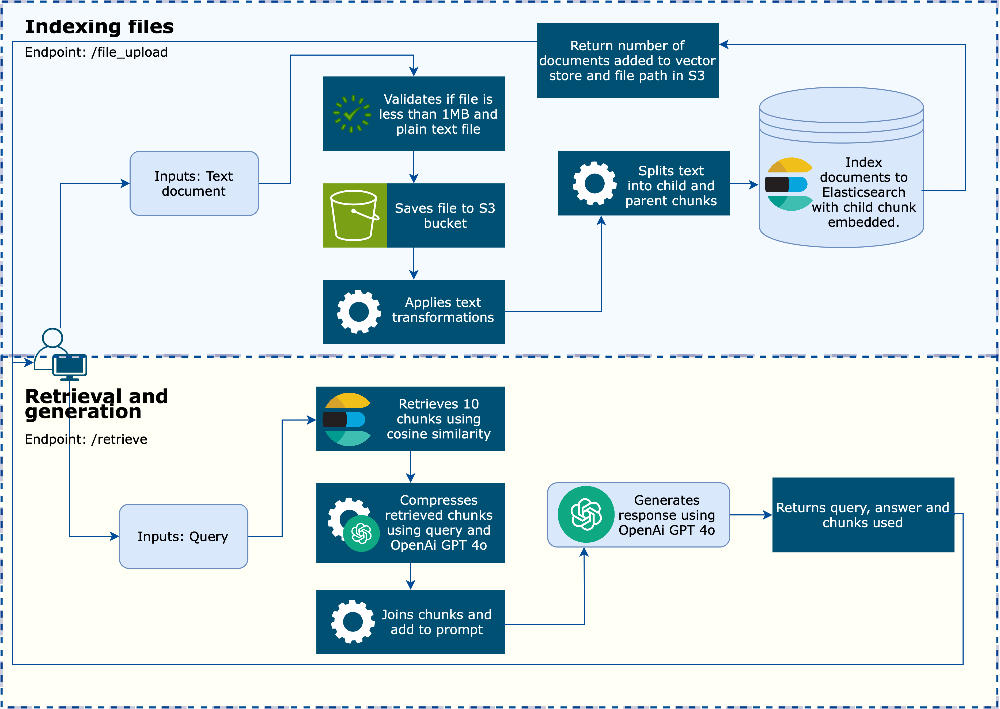
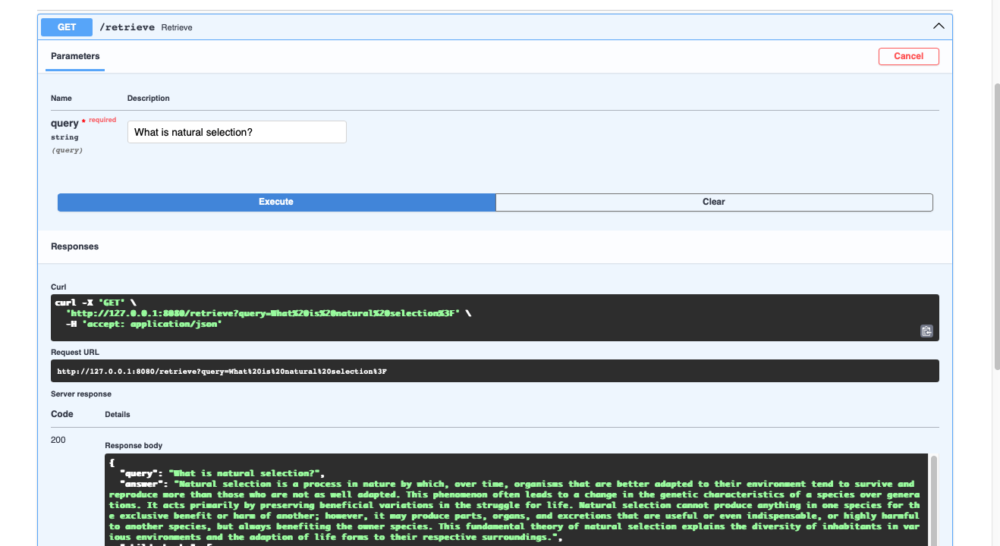

# RAG System MVP for GenAI - Grupo Boticário case

**Problem PT-BR:**

O Grupo Boticário busca talentos para integrar a equipe ded esenvolvimento de soluções inovadoras. Este case desafia você a construir um sistema de IA Generativa utilizando a técnica de Retrieval-Augmented Generation (RAG) para um assistente virtual. O objetivo é oferecer aos usuários uma experiência interativa enriquecida, com respostas precisas e contextualizadas, baseadas em um banco de dados de conhecimento. Para esse case vamos usar o livro de “A Origem das Espécies”.

**Problem EN-US:**

Grupo Boticário is looking for talented individuals to join the team developing innovative solutions. This challenge invites you to build a Generative AI system using the Retrieval-Augmented Generation (RAG) technique for a virtual assistant. The goal is to provide users with an enriched interactive experience, delivering accurate and context-aware responses based on a knowledge database. For this challenge, we will use the book On the Origin of Species.

## Configuring environment

The RAG system consists on configuring an [Elasticsearch vector base](https://www.elastic.co). For this MVP, the vectorbase was created using the free trial deployment at elastic.co , however the vectorbase can be deployed in your platform of choice. The files are also saved as backup to a S3 bucket when uploaded.

This system also requires the usage of OpenAi, therefore needing an
`OPENAI_API_KEY` with credits bought for the account.

This version of code runs currently on Python 3.12.

In order to run the system locally, you can either use the Dockerfile provided or create a virtual environment. Beforehand, a few environment variables must be set:

| Variable                 | Description |
| :----------------------- | :------: |
| AWS_REGION               |   AWS region with access to S3 bucket   | 
| AWS_SECRET_ACCESS_ID     |   AWS secret access id with access to S3 bucket   | 
| AWS_SECRET_ACCESS_KEY    |  AWS secret access key with access to S3 bucket   | 
| ELASTICSEARCH_URL | Elasticsearch vector URL |
| ELASTICSEARCH_TIMEOUT | Max time for request timeout |
| ELASTICSEARCH_CLOUD_ID | Elasticsearch cloud id for deployment |
| ELASTICSEARCH_API_KEY |  Elasticsearch API key with access to write and read |
| HUGGINGFACE_API_TOKEN | HuggingFace token with read access |
| INDEX_NAME | Index name to add chunks into vector |
| OPENAI_API_KEY | OpenAi API key |

In case you prefere running it via a virtualenv, the command to execute the app can be found in the file [entrypoint.sh](entrypoint.sh).

## How does it work?

This RAG system consists of basic RAG architecture, with a few module added during the phases of pre-retrieval and post-retrieval. It also only allows documents that are of plain/text (like .txt files) to be add that are at most 1 mb in size.

During pre-retrieval, the document is parsed to remove any non-word characters that are not punctuation, space, numbers, etc, as decoded to UTF-8 to guarantee that the text has less noise. It is then splitted into various chunks using `RecursiveCharacterTextSplitter`, permitting the structure of "sentences" to be identified. However this is still copnsidering a max chunk size and consideres that the characters used to break the chunks, in order by importance, are: `["\n\n", "\n", " ", "", ".", "!", "?", ")"]`.

Initially (this maintains in the implementation), the document were to be broken into bigger chunks that would act as a "parent" chunk, storaging more information and with these "parent" chunks broken into smaller "child" chunks, that could be used for embedding and search. The usage of these smaller chunks is so that once given a query, the retrieve can compare the embedding of more consice information. You can find this in the [ChunkSplitter class](app/handler/chunk_splitter.py).

For post-retrieval, since the document can be very long and consist of various informations that are all important. A [ContextualCompressionRetriever](https://python.langchain.com/docs/how_to/contextual_compression/) was added. In general, a chunk can consist of content that is important in part, but also have information that can act as noise. A compressior was choosen based on the survey [Searching for Best Practices in Retrieval-Augmented
Generation](https://arxiv.org/pdf/2407.01219), weighing the pros-cons of summarization strategies (Topic 3.7). However, this needs to be better evaluated, for the additional cost might not be beneficial or could be unecessary given pre-retrieval strategies.

Diagram explaning endpoints:

Endpoint example:

## Work in progress

There are still various tasks needed for this MVP to be done. One crucial step is to test the chunk size and its impact in the full system. For that a few things need to be done prior:
- [ ] Test queries need to be made considering various type of conditions. Like: Vague queries, that ask indirectly any type of information or information that is spread out in the text. Queries that are outside of the domain of the text. Ambuiguous queries, that are unclear or have gramatical/semantics errors.
- [ ] Evaluate better pre and post retrieval methods and their impact on the resusts. For this integration tests are needed.
- [ ] Test indexing bottle neck limit.
- [ ] Create unit tests for code.
- [ ] Create deployment workflow using green-blue environment.
- [ ] Add architecture diagram.
- [ ] Add LLM 

## References

- https://medium.com/@anuragmishra_27746/five-levels-of-chunking-strategies-in-rag-notes-from-gregs-video-7b735895694d
- https://arxiv.org/pdf/2407.01219
- https://python.langchain.com/docs/how_to/recursive_text_splitter/
- https://ai.gopubby.com/how-document-chunk-overlap-affects-a-rag-pipeline-9b8931845c20
- https://decodingml.substack.com/p/build-rag-pipelines-that-actually?utm_source=post-email-title&publication_id=1526003&post_id=157246439&utm_campaign=email-post-title&isFreemail=true&r=30n99p&triedRedirect=true&utm_medium=email

## Disclousure 

AI was used for creating commit messages, as well as debugging code when needed.